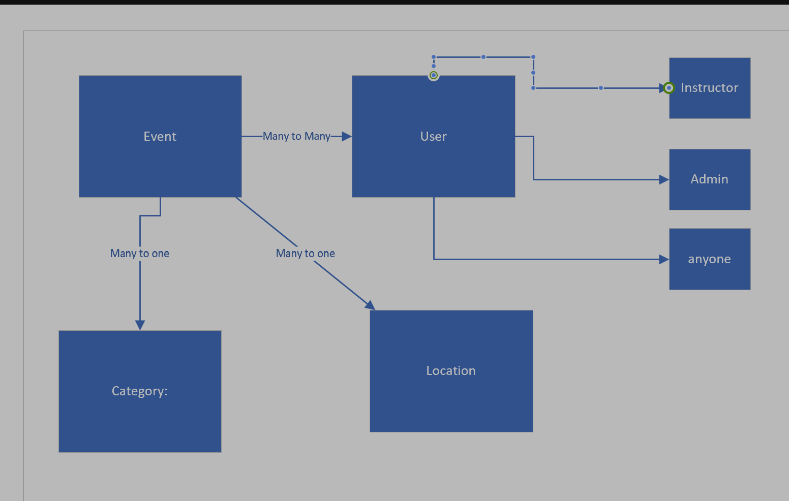
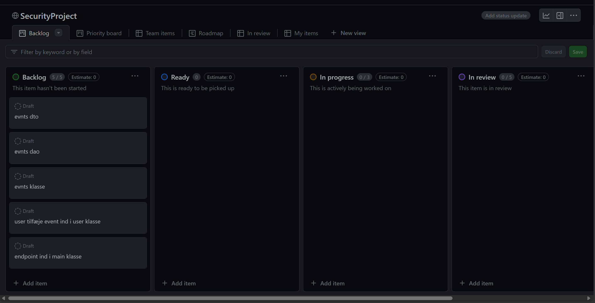

# SecurityProjectGroup6

## Domain digram

# Day 1
Created the EER diagram, GitHub, with branches and KANPAN, 
and discussed how we should handle the project, and who will do what to begin with

# User stories
### Student Stories

* As a user, I want to see all the events/workshops that are going to be held.
* As a user, I want to see the details of a specific event/workshop.
* As a user, I want to register for an event/workshop.
* As a user, I want to cancel my registration for an event/workshop.
* As a user, I want to be able to reset my password. ( How can you make sure that the user is the one who is resetting the password? )
### Instructor Stories

* As an instructor, I want to create a new event/workshop.
* As an instructor, I want to update an event/workshop.
* As an instructor, I want to cancel an event/workshop.
* As an instructor, I want to see all the events/workshops that I am teaching.
* As an instructor, I want to see all the registrations for an event/workshop.
### Admin Stories

* As an admin, I want to see all the users.
* As an admin, I want to see all the events/workshops.
### General Stories

* Implement a way to filter events by category and status.